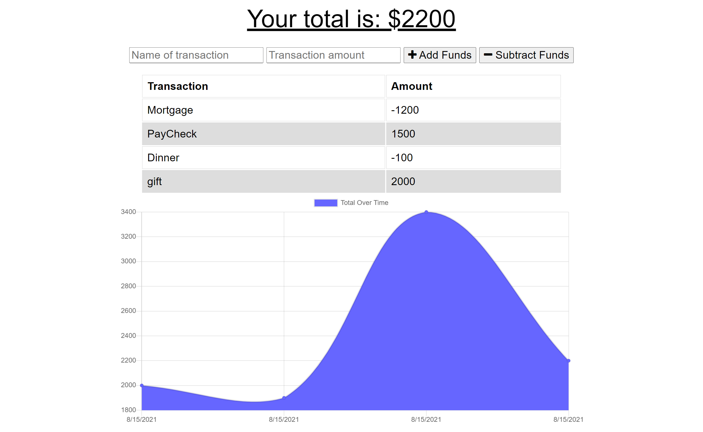

# finance-tracker

  ## Description
  The finance tracker application is a PWA that allows users to track their financial transactions.  This is done through deposits and withdrawals.  The application is able to fully function while offline.  Allowing users to store their transactions in the IndexedDB API and have them populate to the database when online connection returns.

  ## Table of Contents
  * [Installation](#installation)
  * [Usage](#usage)
  * [Deployed-Application-Link](#deployed-application-link)
  * [Deployed-Application-Screenshot](#deployed-application-screenshot)
  * [Questions](#questions)

  
  ## Installation
  *  Clone repo
  *  Install dependencies ```npm install```
  *  To locally start app run ```npm start``` in the cli
  
  
  ## Usage
  To use the project follow the installation instructions.  Once done with that set up a MongoDB Atlas account.  Set up a cluster for this applicaiton and deploy it to heroku.
  
  
  ## Deployed-Application-Link
  
  [Finances Tracker](https://turcott-finance-tracker.herokuapp.com/)
  
  
  ## Deployed-Application-Screenshot
  
  
  
  
  ## Questions
  GitHub: [J2021T](https://github.com/J2021T)

  EMAIL: [jordan.turcott@gmail.com](mailto:jordan.turcott@gmail.com)